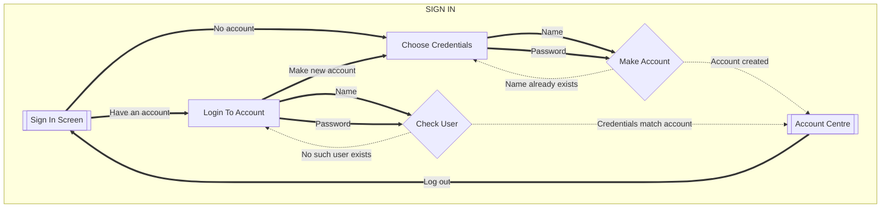
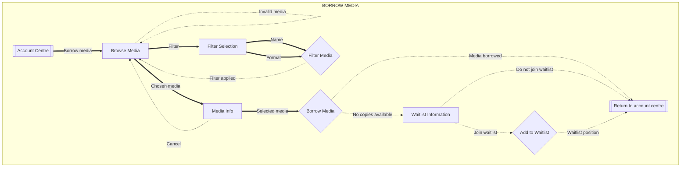
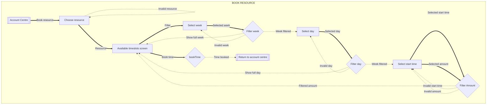
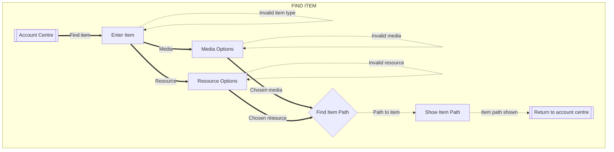
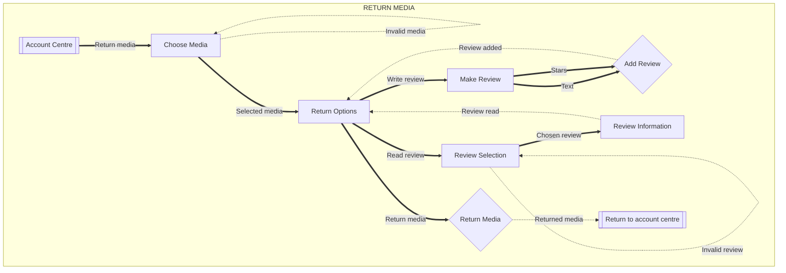

# Overview

LibrarySystem is an implementation of an online system for a library for COMP 2450 in
Fall 2025. LibrarySystem can create libraries with a map and different kinds of media and 
resources. LibrarySystem can also create members who can borrow media, return them, add 
themselves to waitlists for media that are already borrowed, request media from other 
libraries within the system and write reviews for media. Members can also book resources 
at an available time. Members can have various ways of being contacted and can have
constraints placed on their account.

# Running

This project was developed using IntelliJ IDEA and uses Maven, so there are two
ways to run it:

1. Open the class called `Main.java` and click the green play button on the
   `main`method, or
2. Run Maven on the command line:

   ```
   mvn compile exec:java -Dexec.mainClass="ca.umanitoba.cs.egilsons.Main"
   ```

# Testing a stack
Please look at my test data for the stack in the file named
`stack-test-data.xlsx`.

## Why Franklin is a bad programmer

* `BadStack1`
    * My test cases said that the stack remained empty after pushing an
      item onto the stack even though the size was updated.
    * All other methods seemed to work correctly based on the tests I had.
* `BadStack2`
    * My test cases said that the stack had not changed after popping items
      from the stack. So pop() was not removing items from stack.
    * All other methods seemed to work correctly based on the tests I had.
* `BadStack3`
    * My test cases said that the stack was not incrementing the size for
      the first push. Therefore, the size was always one less than it should
      be.
    * All other methods seemed to work correctly based on the tests I had.
* `BadStack4`
    * My test cases said that the stack setting size to 0 every time pop()
      was called, even though only one item is removed.
    * All other methods seemed to work correctly based on the tests I had.
* `BadStack5`
    * My test cases said that all stack methods seemed to work correctly 
      based on the tests I had.

# Flow of interaction

### Sign in
Here is the flowchart for the "Sign In" task:



### Borrow Media
Here is the flowchart for the "Borrow Media" task:



### Book Resource
Here is the flowchart for the "Book Resource" task:



### Find Item
Here is the flowchart for the "Find Item" task:



### Return Media
Here is the flowchart for the "Return Media" task:



# Domain model

## Changes

* I created a Loan class for members to take out media from the library
* I created a Time Slot class that represents an hour block of time
  in a resource that can be booked
* I created a Booking class that stores a month's worth of time slots
* I added attributes for a password, a list of loans called takenOut, 
  a list of time slots called bookings and a list of strings called
  announcements to the Member class
* I added the methods hasOverdueMedia, borrowMedia, returnMedia,
  bookResource, addAnnouncement and removeAnnouncement to the 
  Member class
* I added queue of members as a waitlist to both the Book class and
  the DVD class and the methods frontOfWaitlist and addToWaitlist
  to the Media interface
* I created a Coordinates class to represent coordinates for objects
  on the library map
* I added coordinates as an instance variable to the Book, DVD, 
  Computer and Room classes
* I added a booking object called monthBookings to the Computer and
  Room classes as an attribute
* I added an attribute to the Map class of the coordinates of the kiosk
  for access to the starting point when finding an item path
* I added static methods setMediaCoordinates and setResourceCoordinates 
  that set the coordinates of media and resources based on the map
* I added the Stack interface and LinkedListStack class to help with
  path finding
* I added values for the kiosk, path and destination to the MapType enum
  to mark them on the map
* I removed the removeMedia method from the Library class as it was not used
* I removed the removeMember method from the LibrarySystem class as it was
  not used

## Diagram
Here's my domain model:

```mermaid
classDiagram
    class LibrarySystem {
        %% Collection of libraries
        -List~Library~ libraries
        %% Collection of members with no duplicate members
        -TreeSet~Member~ members
        
        +addLibrary(Library library) void
        +addMember(Member member) void
    }
    LibrarySystem --* Library
    LibrarySystem --* Member

    note for LibrarySystem "Invariant properties:
    <ul>
        <li>libraries != null
        <li>members != null
        <li>loop: no libraries are null in libraries.
        <li>loop: no members are null in members.
    </ul>"
    
    class Library {
        %% Text for the name of the library
        -String name
        %% Collection of media in the library
        -List~Media~ media
        %% Collection of resources in the library
        -List~Resource~ resources
        %% An overhead visual representation of 
        %% the library
        -Map map
        
        +addResource(Resource resource) void
        +addMedia(Media media) void
        -updateMap() void
    }
    Library --* Media
    Library --* Resource
    Library --* Map

    note for Library "Invariant properties:
    <ul>
        <li>name != null
        <li>name.length() >= 1
        <li>media != null
        <li>resources != null
        <li>map != null
        <li>loop: no media are null in media.
        <li>loop: no resources are null in resources.
    </ul>"
    
    class Member {
        %% Text for the name of the member
        -String name
        %% Text for the password of the member
        -String password
        %% Collection of loans taken out of the library
        -List~Loan~ takenOut
        %% Collection of reserved slots at a resource
        %% in the library
        -List~TimeSlot~ bookings
        %% Collection of titles that have become available
        -List~String~ announcements

        +hasOverdueMedia() boolean
        +compareTo(Member other) int
        +borrowMedia(Media media) boolean
        +returnMedia(Media media) void
        +bookResource(TimeSlot slot, Resource resource) void
        +addAnnouncement(String title) void
        +removeAnnouncement(String title) void
    }
    Member --* Loan
    Member --o TimeSlot

    note for Member "Invariant properties:
    <ul>
        <li>name != null
        <li>name.length() >= 1
        <li>password != null
        <li>password.length() >= 1
        <li>takenOut != null
        <li>bookings != null
        <li>announcements != null
        <li>loop: no loans are null in takenOut.
        <li>loop: no time slots are null in bookings.
        <li>loop: no strings are null in announcements.
    </ul>"
    
    class Media {
        <<interface>>
        +frontOfWaitlist(Member member) boolean
        +equals(Media other) boolean
        +addCopy() void
        +takeOutCopy() Media
        +addToWaitlist(Member member) void
        +addReview(Review review) void
    }
    Media --* Review
    Media --* MediaCategory
    Media --o Coordinates
    Media --o Member

    class Book {
        %% Text for the title of the book
        -String title
        %% Text for the name of the author
        -String author
        %% A positive number of pages
        -int pages
        %% The type of category or genre
        -MediaCategory category
        %% Has to be a positive number or zero
        -int copies
        %% Collection of reviews about the book
        -List~Reviews~ reviews
        %% Collection of members waiting to take out the book
        -Queue~Member~ waitlist
        %% Coordinates on the library map
        -Coordinates coordinates

        +frontOfWaitlist(Member member) boolean
        +equals(Media other) boolean
        +addCopy() void
        +takeOutCopy() Media
        +addToWaitlist(Member member) void
        +addReview(Review review) void
    }
    Book ..|> Media

    note for Book "Invariant properties:
    <ul>
        <li>title != null
        <li>title.length() >= 1
        <li>author != null
        <li>author.length() >= 1
        <li>pages > 0
        <li>category != null
        <li>copies >= 0
        <li>reviews != null
        <li>waitlist != null
        <li>coordinates != null
        <li>loop: no reviews are null in reviews.
        <li>loop: no members are null in waitlist.
    </ul>"

    class DVD {
        %% Text for the title of the DVD
        -String title
        %% Text for the name of the director
        -String director
        %% A positive number for the length of the 
        %% movie
        -int runTime
        %% The type of category or genre
        -MediaCategory category
        %% Has to be a positive number or zero
        -int copies
        %% Collection of reviews about the DVD
        -List~Reviews~ reviews
        %% Collection of members waiting to take out the DVD
        -Queue~Member~ waitlist
        %% Coordinates on the library map
        -Coordinates coordinates

        +frontOfWaitlist(Member member) boolean
        +equals(Media other) boolean
        +addCopy() void
        +takeOutCopy() Media
        +addToWaitlist(Member member) void
        +addReview(Review review) void
    }
    DVD ..|> Media

    note for DVD "Invariant properties:
    <ul>
        <li>title != null
        <li>title.length() >= 1
        <li>director != null
        <li>director.length() >= 1
        <li>runTime > 0
        <li>category != null
        <li>copies >= 0
        <li>reviews != null
        <li>waitlist != null
        <li>coordinates != null
        <li>loop: no reviews are null in reviews.
        <li>loop: no members are null in waitlist.
    </ul>"
    
    class Loan {
        %% The media the loan is for
        -Media media
        %% The time starting when the media was borrowed
        -LocalDateTime borrowDate
        %% The time the media needs to be returned by
        -LocalDateTime returnDate
        
        +isOverdue() boolean
    }
    Loan --o Media

    note for Loan "Invariant properties:
    <ul>
        <li>media != null
        <li>borrowDate != null
        <li>returnDate != null
    </ul>"
    
    class Resource {
        <<interface>>
    }
    Resource --* Booking
    Resource --o Coordinates
    
    class Computer {
        %% A positive number representing the
        %% amount in a library
        -int number
        %% Time slots for the month that can
        %% be booked
        -Booking monthBookings
        %% Has to be a positive number or zero
        -static int count
        %% Coordinates on the library map
        -Coordinates coordinates
    }
    Computer ..|> Resource

    note for Computer "Invariant properties:
    <ul>
        <li>number > 0
        <li>monthBookings != null
        <li>count >= 0
        <li>coordinates != null
    </ul>"
    
    class Room {
        %% A positive number representing the
        %% amount in a library
        -int number
        %% Time slots for the month that can
        %% be booked
        -Booking monthBookings
        %% Has to be a positive number or zero
        -static int count
        %% Coordinates on the library map
        -Coordinates coordinates
    }
    Room ..|> Resource

    note for Room "Invariant properties:
    <ul>
        <li>number > 0
        <li>monthBookings != null
        <li>count >= 0
        <li>coordinates != null
    </ul>"
    
    class Booking {
        %% Time slots for a month
        -TimeSlot[][][] monthBookings
        
        +book(int week, int day, int startTime) void
    }
    Booking --* TimeSlot

    note for Booking "Invariant properties:
    <ul>
        <li>monthBookings != null
        <li>loop: no time slots are null in monthBookings.
    </ul>"
    
    class TimeSlot {
        %% Has to be between 8am and 7pm
        -int startHour;
        %% Has to be between 9am and 8pm
        -int endHour;
        %% Has to be between 1 and 7
        -int day;
        %% Has to be between 1 and 4
        -int week;
        %% Shows if the time slot has been reserved
        -boolean booked;
        
        +book() boolean
    }

    note for TimeSlot "Invariant properties:
    <ul>
        <li>startHour >= 8 && startHour < 20
        <li>endHour > 8 && endHour <= 20
        <li>day >= 1 && day <= 7
        <li>week >= 1 && week <= 4
    </ul>"

    class Review {
        %% The member who made the review
        -Member member
        %% The media the review is about
        -Media media
        %% Optional text that expresses the member's 
        %% opinion on the media
        -String text
        %% Number between 1 and 5
        -int stars
    }
    Review --o Member

    note for Review "Invariant Properties:
    <ul>
        <li>member != null
        <li>media != null
        <li>text != null
        <li>text.length() >= 1
        <li>stars > 0 && stars <= 5
    </ul>"
    
    class Map {
        %% An overhead visual representation of the map
        -MapType[][] display
        %% Coordinates for the kiosk on the map
        -Coordinates kiosk
        
        -pickBookshelfNum(Media media) int
        +static setMediaCoordinates(Media media) Coordinates
        +static setResourceCoordinates(Resource resource) Coordinates
    }
    Map --* MapType
    Map --* Coordinates
    Map --o Media
    Map --o Resource

    note for Map "Invariant properties:
    <ul>
        <li>display != null
        <li>kiosk != null
    </ul>"
    
    class Coordinates {
        <<record>>
        -int row
        -int column
    }
    
    class Stack {
        <<interface>>
        +push(T item) void
        +pop() T
        +size() int
        +isEmpty() boolean
        +peek() T
    }
    
    class LinkedListStack {
        %% The top of the stack
        -Node~T~ top
        %% The amount of entries in the stack
        -int nodeCount

        +push(T item) void
        +pop() T
        +size() int
        +isEmpty() boolean
        +peek() T
    }
    LinkedListStack ..|> Stack

    note for LinkedListStack "Invariant properties:
    <ul>
        <li>nodeCount >= 0
    </ul>"
    
    class MapType {
        <<enumeration>>
        WALL,
        EXIT,
        DESK,
        KIOSK,
        ROOM_DOOR,
        COMPUTER,
        FANTASY_SECTION,
        YOUNG_ADULT_SECTION,
        ROMANCE_SECTION,
        SCIENCE_FICTION_SECTION,
        CHILDREN_SECTION,
        HISTORICAL_FICTION_SECTION,
        NON_FICTION_SECTION,
        MYSTERY_SECTION,
        HORROR_SECTION,
        PATH,
        DESTINATION
    }
    
    class MediaCategory {
        <<enumeration>>
        FANTASY,
        YOUNG ADULT,
        ROMANCE,
        SCIENCE FICTION,
        CHILDREN'S,
        HISTORICAL FICTION,
        NON-FICTION,
        MYSTERY,
        HORROR
    }

```

