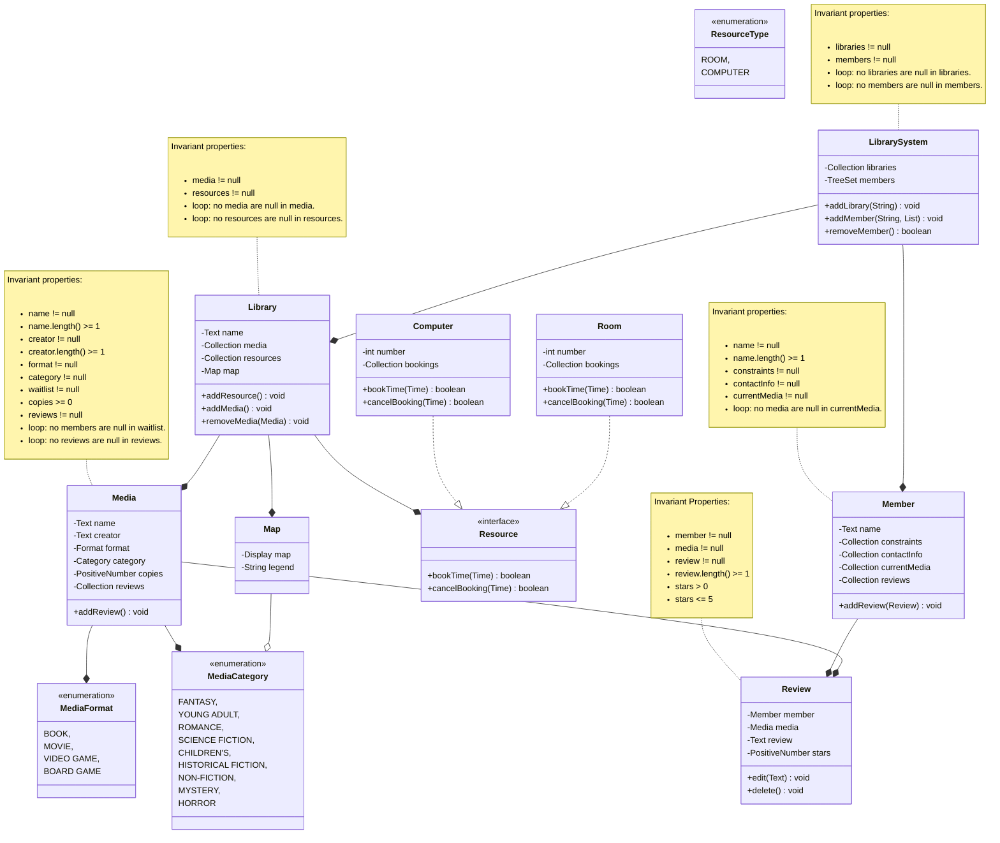

```mermaid
classDiagram
    class LibrarySystem {
        -Collection libraries
        -TreeSet members
        
        %% For now replaces the old instance with a new instance
        +addLibrary(String) void
        %% don't want duplicates, use "set"?
        +addMember(String, List<String>) void
        +removeMember() boolean
    }
    LibrarySystem --* Library
    LibrarySystem --* Member

    note for LibrarySystem "Invariant properties:
    <ul>
        <li>libraries != null
        <li>members != null
        <li>loop: no libraries are null in libraries.
        <li>loop: no members are null in members.
    </ul>"
    
    class Library {
        %% interface?
        -Text name
        -Collection media
        -Collection resources
        -Map map
        
        +addResource() void
        +addMedia() void
        +removeMedia(Media) void
    }
    Library --* Media
    Library --* Resource
    Library --* Map

    note for Library "Invariant properties:
    <ul>
        <li>media != null
        <li>resources != null
        <li>loop: no media are null in media.
        <li>loop: no resources are null in resources.
    </ul>"
    
    class Member {
        %% class
        %% becoming member for entire system
        -Text name
        -Collection constraints
        -Collection contactInfo
        -Collection currentMedia
        -Collection reviews
        %% Library card number?
        
        %% asks for member, so should be in library?
        +addReview(Review) void
    }
    Member --* Review

    note for Member "Invariant properties:
    <ul>
        <li>name != null
        <li>name.length() >= 1
        <li>constraints != null
        <li>contactInfo != null
        <li>currentMedia != null
        <li>loop: no media are null in currentMedia.
    </ul>"

    
    class Media {
        %%record
        %% class for copies and lists
        -Text name
        -Text creator
        -Format format
        -Category category
        -PositiveNumber copies
        -Collection reviews
        %% should waitlist be a stack?
 
        +addReview() void
    }
    Media --* Review
    Media --* MediaCategory
    Media --* MediaFormat

    note for Media "Invariant properties:
    <ul>
        <li>name != null
        <li>name.length() >= 1
        <li>creator != null
        <li>creator.length() >= 1
        <li>format != null
        <li>category != null
        <li>waitlist != null
        <li>copies >= 0
        <li>reviews != null
        <li>loop: no members are null in waitlist.
        <li>loop: no reviews are null in reviews.
    </ul>"
    
    class Resource {
        <<interface>>
        %% time
        +bookTime(Time) boolean
        +cancelBooking(Time) boolean
    }
    
    class Computer {
        -int number
        -Collection bookings
        +bookTime(Time) boolean
        +cancelBooking(Time) boolean
    }
    Computer ..|> Resource
    
    class Room {
        -int number
        -Collection bookings
        +bookTime(Time) boolean
        +cancelBooking(Time) boolean
    }
    Room ..|> Resource
    
    class Map {
        -Display map
        %% Written list of symbols
        -String legend
    }
    Map --o MediaCategory
    
    class Review {
        %% can also review resources!!!
        -Member member
        -Media media
        -Text review
        -PositiveNumber stars
        %% Stars?
        %% record?
        
        +edit(Text) void
        +delete() void
    }
    
    note for Review "Invariant Properties:
    <ul>
        <li>member != null
        <li>media != null
        <li>review != null
        <li>review.length() >= 1
        <li>stars > 0
        <li>stars <= 5
    </ul>"
    
    class MediaCategory {
        <<enumeration>>
        FANTASY,
        YOUNG ADULT,
        ROMANCE,
        SCIENCE FICTION,
        CHILDREN'S,
        HISTORICAL FICTION,
        NON-FICTION,
        MYSTERY,
        HORROR
    }
    
    class MediaFormat {
        <<enumeration>>
        BOOK,
        MOVIE,
        VIDEO GAME,
        BOARD GAME
    }

    class ResourceType{
        <<enumeration>>
        ROOM,
        COMPUTER
    }
```