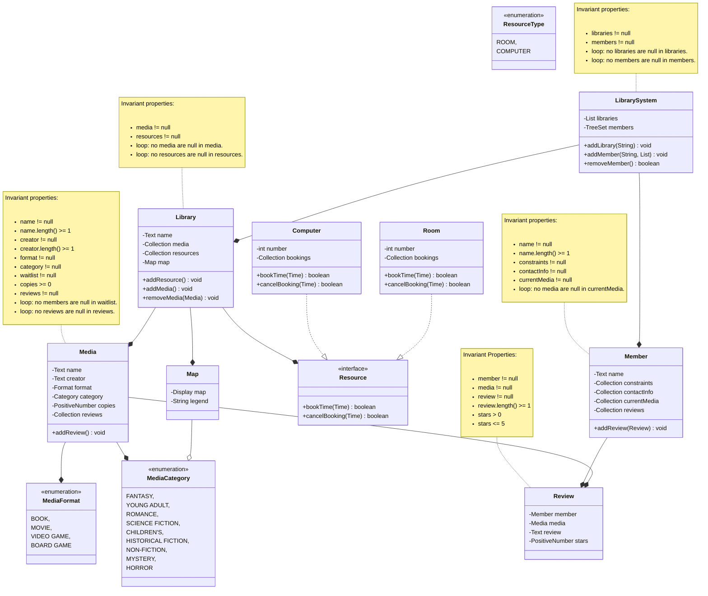

# Overview

LibrarySystem is an implementation of an online system for a library for COMP 2450 in
Fall 2025. LibrarySystem can create libraries with a map and different kinds of media and 
resources. LibrarySystem can also create members who can borrow media, return them, add 
themselves to waitlists for media that are already borrowed, request media from other 
libraries within the system and write reviews for media. Members can also book resources 
at an available time. Members can have various ways of being contacted and can have
constraints placed on their account.

# Running

This project was developed using IntelliJ IDEA and uses Maven, so there are two
ways to run it:

1. Open the class called `Main.java` and click the green play button on the
   `main`method, or
2. Run Maven on the command line:

   ```
   mvn compile exec:java -Dexec.mainClass="ca.umanitoba.cs.egilsons.Main"
   ```

# Domain model

Here's my domain model:

